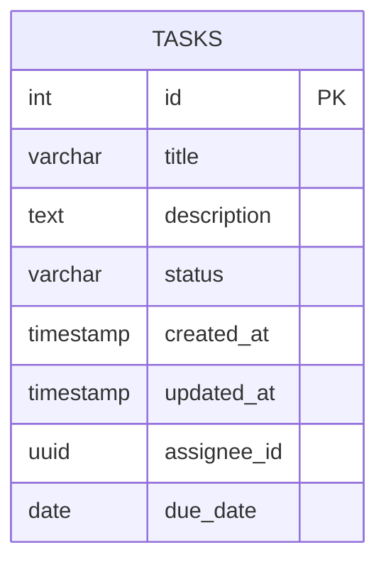

# Design Document - Task Management API (v1)

## 1. ERD (Entity Relationship Diagram)



### Chi tiết bảng `tasks`

| Cột | Kiểu dữ liệu | Ràng buộc | Ghi chú |
|---|---|---|---|
| id | INTEGER | PRIMARY KEY | Tự tăng |
| title | VARCHAR(200) | NOT NULL | Tên task |
| description | TEXT | nullable | Mô tả chi tiết |
| status | VARCHAR(20) | NOT NULL, DEFAULT 'pending' | pending / in_progress / completed |
| created_at | TIMESTAMP | DEFAULT CURRENT_TIMESTAMP | Thời điểm tạo |
| updated_at | TIMESTAMP | DEFAULT CURRENT_TIMESTAMP | Thời điểm cập nhật gần nhất |
| assignee_id | UUID | nullable | Người được giao (chưa có bảng users liên kết ở v1) |
| due_date | DATE | nullable | Hạn hoàn thành |

**Ghi chú v1:** `assignee_id` hiện chưa có foreign key tới bảng `users` vì bảng đó chưa được thiết kế trong phạm vi Week 1. Sẽ bổ sung constraint ở version sau khi có bảng `users`.

## 2. API List

| # | Method | Endpoint | Mô tả | Request body | Response |
|---|---|---|---|---|---|
| 1 | POST | `/tasks/` | Tạo task mới | `TaskCreate` | `TaskOut` (201) |
| 2 | GET | `/tasks/` | Danh sách task, hỗ trợ search/filter | Query: `search`, `status`, `assignee_id`, `skip`, `limit` | `List[TaskOut]` |
| 3 | GET | `/tasks/{id}` | Chi tiết 1 task | - | `TaskOut` hoặc 404 |
| 4 | PUT | `/tasks/{id}` | Cập nhật task | `TaskUpdate` (partial) | `TaskOut` hoặc 404 |
| 5 | PATCH | `/tasks/{id}/complete` | Đánh dấu hoàn thành | - | `TaskOut` hoặc 404 |
| 6 | DELETE | `/tasks/{id}` | Xoá task | - | `{"detail": "..."}` hoặc 404 |

### Schema

**TaskCreate / TaskBase**
```json
{
  "title": "string (required, max 200)",
  "description": "string (optional)",
  "status": "pending | in_progress | completed (optional, default pending)",
  "assignee_id": "uuid (optional)",
  "due_date": "date (optional, YYYY-MM-DD)"
}
```

**TaskOut** (response) — thêm so với TaskBase:
```json
{
  "id": "int",
  "created_at": "datetime",
  "updated_at": "datetime | null"
}
```

## 3. Design Note

### Kiến trúc

Áp dụng phân lớp 3 tầng đơn giản để tách biệt trách nhiệm:

```
Router (HTTP layer)
   ↓
Service (Business logic)
   ↓
Model (Data layer / ORM)
```

- **Router** (`task_router.py`): chỉ định nghĩa endpoint, nhận request, gọi service, trả response. Không chứa logic nghiệp vụ.
- **Service** (`task_service.py`): chứa toàn bộ logic xử lý (tạo, sửa, xoá, tìm kiếm, filter). Dễ test độc lập, không phụ thuộc FastAPI.
- **Model** (`task_data.py`): định nghĩa cấu trúc bảng bằng SQLAlchemy ORM.
- **Schema** (`task_schema.py`): dùng Pydantic để validate dữ liệu vào/ra, tách biệt hoàn toàn với model database — cho phép API trả về định dạng khác cấu trúc bảng thật nếu cần sau này.

### Quyết định thiết kế

1. **Dùng `status` (string enum) thay vì `completed` (boolean)**: cho phép mở rộng nhiều trạng thái hơn (pending / in_progress / completed) thay vì chỉ 2 trạng thái xong/chưa xong.
2. **Search dùng `ILIKE`**: tìm kiếm không phân biệt hoa thường, khớp một phần chuỗi trong `title`.
3. **Filter kết hợp được với search**: các query param (`search`, `status`, `assignee_id`) độc lập, có thể dùng riêng hoặc kết hợp cùng lúc.
4. **Dùng Neon (PostgreSQL serverless)**: phù hợp môi trường học tập/dev, không cần cài PostgreSQL local, tránh vấn đề quyền hạn trên máy công ty.
5. **`Base.metadata.create_all()` thay vì Alembic**: đơn giản hoá cho v1, phù hợp giai đoạn học tập. Sẽ cân nhắc chuyển sang Alembic migration khi schema phức tạp hơn hoặc cần version control cho database.

### Xử lý lỗi

- Input sai định dạng/thiếu field bắt buộc → Pydantic tự động trả `422 Unprocessable Entity` kèm chi tiết field lỗi.
- Task không tồn tại (get/update/complete/delete theo id) → service trả `None`/`False`, router chuyển thành `404 Not Found`.

### Hạn chế / việc cần làm tiếp (out of scope v1)

- Chưa có bảng `users` và foreign key thật cho `assignee_id`.
- Chưa có authentication/authorization.
- Chưa có pagination mặc định rõ ràng ở tầng response (mới có `skip`/`limit` param).
- Frontend (UI hiển thị loading / empty / success / error state) chưa được xây dựng trong phạm vi tài liệu này.
